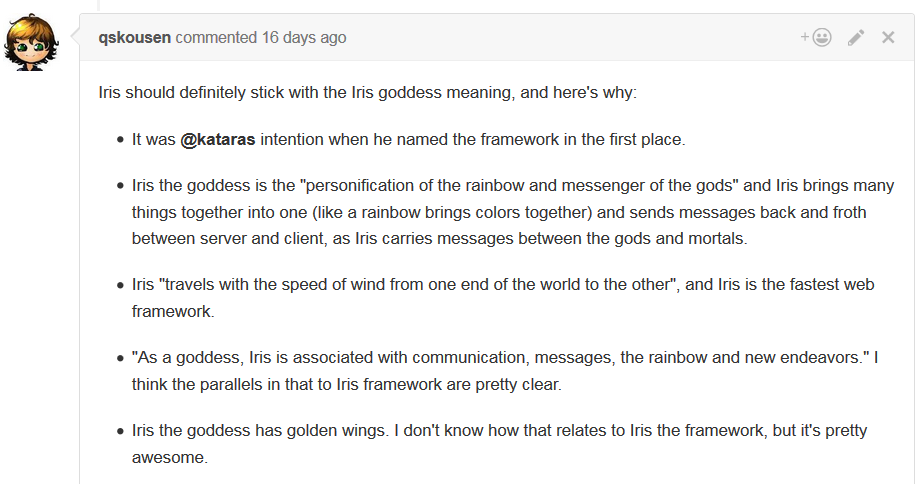
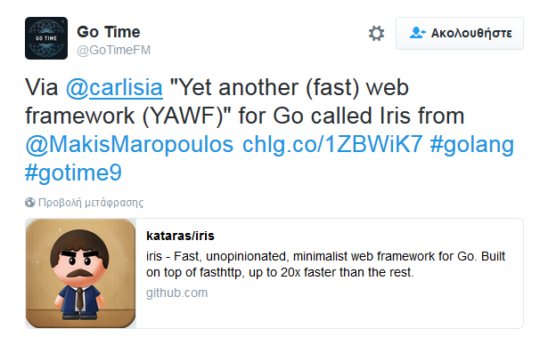
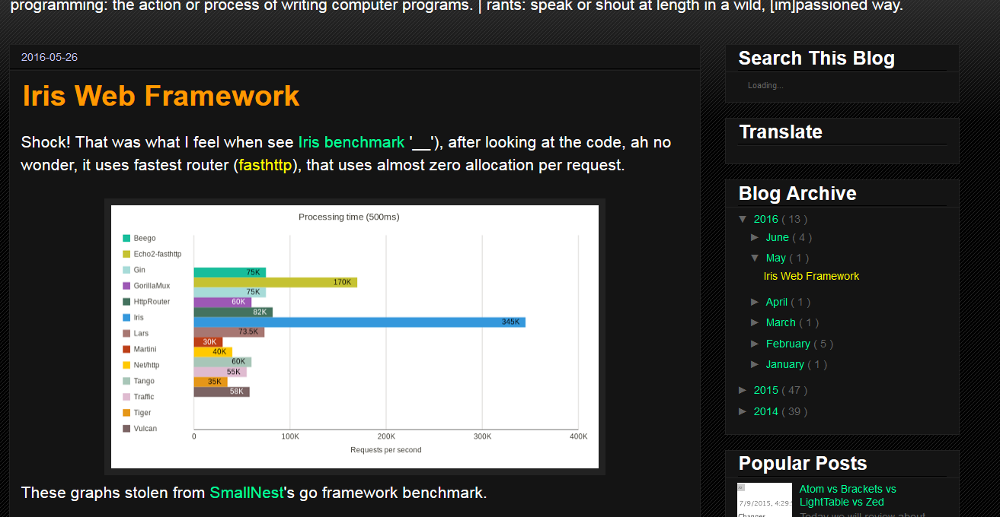
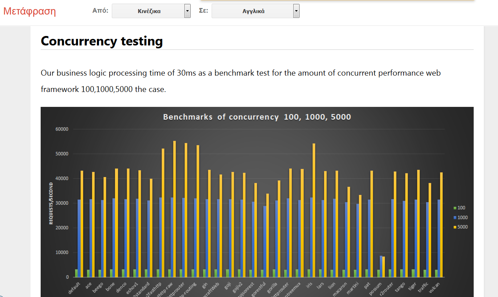

## Table of Contents

* [Introduction](README.md)
* [Features](features.md)
* [Versioning](versioning.md)
* [Install](install.md)
* [Hi](hi.md)
* [Transport Layer Security](tls.md)
* [Handlers](handlers.md)
   * [Using Handlers](using-handlers.md)
   * [Using HandlerFuncs](using-handlerfuncs.md)
   * [Using custom struct for a complete API](using-handlerapi.md)
   * [Using native http.Handler](using-native-httphandler.md)
       * [Using native http.Handler via iris.ToHandlerFunc()](using-native-httphandler-via-tohandlerfunc.md)
* [Middlewares](middlewares.md)
* [API](api.md)
* [Declaration](declaration.md)
* [Configuration](configuration.md)
* [Party](party.md)
* [Subdomains](subdomains.md)
* [Named Parameters](named-parameters.md)
* [Static files](static-files.md)
* [Send files](send-files.md)
* [Send e-mails](mail.md)
* [Render](render.md)
   * [REST](render_rest.md)
   * [Templates](render_templates.md)
* [Gzip](gzip.md)
* [Streaming](streaming.md)
* [Cookies](cookies.md)
* [Flash messages](flashmessages.md)
* [Body binder](request-body-bind.md)
* [Custom HTTP Errors](custom-http-errors.md)
* [Context](context.md)
* [Logger](logger.md)
* [HTTP access control](middleware-cors.md)
* [Basic Authentication](basic-authentication.md)
* [Secure](middleware-secure.md)
* [Sessions](package-sessions.md)
* [Websockets](package-websocket.md)
* [Graceful](package-graceful.md)
* [Recovery](middleware-recovery.md)
* [Plugins](plugins.md)
* [Internationalization and Localization](middleware-internationalization-and-localization.md)
* [Easy Typescript](plugin-typescript.md)
* [Browser based Editor](plugin-editor.md)
* [Control panel](plugin-iriscontrol.md)
* Examples here: http://.github.com/iris-contrib/examples

### Why

Go is a great technology stack for building scalable, web-based, back-end systems for web 
applications. 

When you think about building web applications and web APIs, or simply building HTTP servers in Go, does your mind go to the standard net/http package?
Then you have to deal with some common situations like dynamic routing (a.k.a parameterized), security and authentication, real-time communication and many other issues that net/http doesn't solve. 

The net/http package is not complete enough to quickly build well-designed back-end web systems. When you realize this, you might be thinking along these lines:

- Ok, the net/http package doesn't suit me, but there are so many frameworks, which one will work for me?!
- Each one of them tells me that it is the best. I don't know what to do!

##### The truth

I did some deep research and benchmarks with 'wrk' and 'ab' in order to choose which framework would suit me and my new project. The results, sadly, were really disappointing to me.

I started wondering if golang wasn't as fast on the web as I had read... but, before I let Golang go and continued to develop with nodejs, I told myself:

> '**Makis, don't lose hope, give at least a chance to Golang. Try to build something totally new without basing it off the "slow" code you saw earlier; learn the secrets of this language and make *others* follow your steps!**'.

These are the words I told myself that day [**13 March 2016**]. 

The same day, later the night, I was reading a book about Greek mythology. I saw an ancient goddess' name and was inspired immediately to give a name to this new web framework (which I had already started writing) - **Iris**.

**Two months later**, I'm writing this intro. 

 I'm still here [because Iris has succeed in being the fastest go web framework](https://github.com/kataras/iris#benchmarks)

