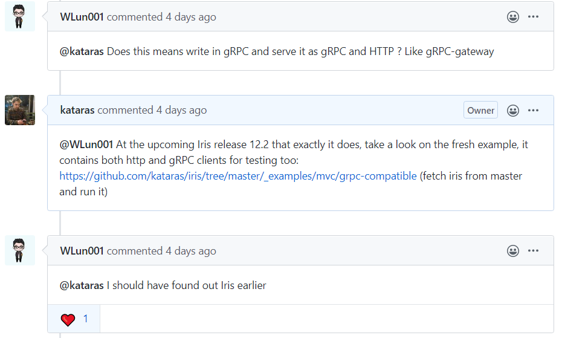

# gRPC

gRPC[\*](https://grpc.io/) is a modern open source high performance Remote Procedure Call framework that can run in any environment. It can efficiently connect services in and across data centers with pluggable support for load balancing, tracing, health checking and authentication. It is also applicable in last mile of distributed computing to connect devices, mobile applications and browsers to backend services.

Iris and gRPC integration lives inside the [mvc](https://github.com/kataras/iris/tree/master/mvc) package.

Have you ever have difficulties converting your app or parts of it from HTTP to gGRPC or did you ever wish you had decent HTTP framework support as well for your gRPC services? Now, with Iris you have the best of two worlds. Without change a bit of your existing gRPC services code, you can register them as Iris HTTP routes through a Controller (your service struct value).



> Learn more about our conversation at: [https://github.com/kataras/iris/issues/1449\#issuecomment-623260695](https://github.com/kataras/iris/issues/1449#issuecomment-623260695)

## Step by step

We will follow the [official helloworld gRPC example](https://github.com/grpc/grpc-go/tree/master/examples/helloworld). If you had already work with gRPC services you can skip 1-5.

**1.** Let's write our proto schema for request and response.

```text
syntax = "proto3";

package helloworld;

// The greeting service definition.
service Greeter {
  // Sends a greeting
  rpc SayHello (HelloRequest) returns (HelloReply) {}
}

// The request message containing the user's name.
message HelloRequest {
  string name = 1;
}

// The response message containing the greetings
message HelloReply {
  string message = 1;
}
```

**2.** Install the protoc Go plugin

```bash
$ go get -u github.com/golang/protobuf/protoc-gen-go
```

**3.** Generate Go file from the helloworld.proto file above

```bash
$ protoc -I helloworld/ helloworld/helloworld.proto --go_out=plugins=grpc:helloworld
```

**4.** Implement a gRPC service as usually, with or without Iris

```go
import (
    // [...]
    pb "myapp/helloworld"
    "context"
)
```

```go
type Greeter struct { }

// SayHello implements helloworld.GreeterServer.
func (c *Greeter) SayHello(ctx context.Context, in *pb.HelloRequest) (*pb.HelloReply, error) {
    return &pb.HelloReply{Message: "Hello " + in.GetName()}, nil
}
```

Iris automatically binds the standard "context" `context.Context` to `iris.Context.Request().Context()` and any other structure that is not mapping to a registered dependency as a payload (depending on the request), e.g XML, YAML, Query, Form, JSON, Protobuf.

**5.** Register your service to the gRPC server

```go
import (
    // [...]
    pb "myapp/helloworld"
    "google.golang.org/grpc"
)
```

```go
grpcServer := grpc.NewServer()

myService := &Greeter{}
pb.RegisterGreeterServer(grpcServer, myService)
```

**6.** Register this `myService` to Iris

The `mvc.New(party).Handle(ctrl, mvc.GRPC{...})` option allows to register gRPC services per-party (without the requirement of a full wrapper) and optionally strict access to gRPC-only clients.

Register MVC application controller for gRPC services. You can bind as many mvc gRpc services in the same Party or app, as the `ServiceName` differs.

```go
import (
    // [...]
    "github.com/kataras/iris/v12"
    "github.com/kataras/iris/v12/mvc"
)
```

```go
app := iris.New()

rootApp := mvc.New(app)
rootApp.Handle(myService, mvc.GRPC{
    Server:      grpcServer,           // Required.
    ServiceName: "helloworld.Greeter", // Required.
    Strict:      false,
})
```

**7.** Generate TLS Keys

The Iris server **should ran under TLS** (it's a gRPC requirement).

```bash
$ openssl genrsa -out server.key 2048
$ openssl req -new -x509 -sha256 -key server.key -out server.crt -days 3650
```

**8.** Listen and Serve

```go
app.Run(iris.TLS(":443", "server.crt", "server.key"))
```

POST: `https://localhost:443/helloworld.Greeter/SayHello` with request data: `{"name": "John"}` xpected output: `{"message": "Hello John"}`.

Both HTTP Client and gRPC client will be able to communicate with our Iris+gRPC service.

### Exercise files

Full Server, Clients and Testing Code can be found at: [https://github.com/kataras/iris/tree/master/\_examples/mvc/grpc-compatible](https://github.com/kataras/iris/tree/master/_examples/mvc/grpc-compatible).


<!-- slide:break-100 -->
